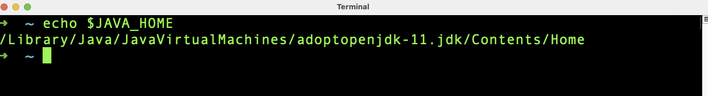
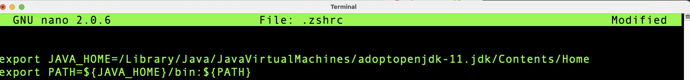
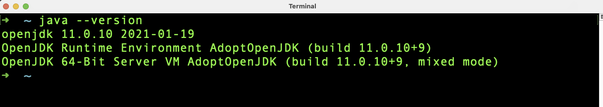

<h1 align="center">Module 1 - Preparation</h1>

## What will you learn in this module

In this module i'll show you what you need to program with Java.

### Requirements

- PC, Laptop or Mac
- Windows,Linux or OSX  operating system installed
- [Java Development Kit](#1)
- [Text editor or IDE](#2)
- Coffee

### Java Development Kit<a name="1"></a>

To program with Java, you need a Java Development Kit (JDK for short), which must be installed on your development computer. It's free to you which version of JDK you want to use, for this course i use AdoptOpenJDK11.

You can download a JDK from the following websites (Be sure you download the JDK not the JRE).
- [Oracle](https://www.oracle.com/java/technologies/downloads/)
- [Oracle OpenJDK](https://jdk.java.net/)
- [AdoptOpenJDK](https://adoptopenjdk.net/)[^1][^2]
- [OpenJDK](https://openjdk.java.net/)

[^1]: recommended.
[^2]: AdoptOpenJDK is moving to the Eclipse Foundation and rebranding [https://adoptium.net/].

I recommend to download the installer package (msi, rpm, deb, dmg) for your operating system but if you want you can download the zip/tar.gz archive as well.

#### Installtion of the JDK

Once you've downloaded the installer, the installation is pretty straightforward.

Navigate to the folder where you downloaded the file and double-click the installer. Follow the instructions and you are almost good to go.

When you have downloaded the archive, you will need to extract the archive to a location where you have read / write access.

#### Environment Variables

Last but not least, check that Java is also available in the console.

The easiest way to open a console window is to use the application launcher from the application list of your OS.

Alternate way :

- Windows
  - Press the Windows-Key on your keyboard
  - Type: <strong>cmd</strong> and hit enter
  
- OSX
  - Press cmd+space on your keyboard
  - Type: <strong>terminal</strong> and hit enter

- Linux (Ubunut/Mint)
  - Press Ctrl+Alt+T 

- Linux (Debian)
  - Press Alt+F2
  - Type: <strong>terminal</strong> and hit enter

In the console window type <strong>echo $JAVA_HOME</strong> and hit enter.



If no path is displayed, you must set the JAVA_HOME variable.

- Windows
  - Right click My Computer and select Properties.
  - On the Advanced tab, select Environment Variables
  - Click on <strong>New...</strong> Button under the <strong>User variables</strong> window
  - In the new window type <strong>JAVA_HOME</strong> in the name field. In the <strong>values</strong> field you have to write the path to the installation of the JDK (ex.: C:\Program Files\Java\adoptopenjdk-11\bin). Click <strong>OK</strong> to leave this window.
  - You have to click <strong>OK</strong> twice to leave the settings window.

- Linux/OSX
  - Depending on your shell (zsh/bash and so on) you have to search for a hidden file in your home directory. Name of the file could be <strong>.profile</strong>, <strong>.zshrc</strong> or something like that. 
  - Open that file with vi/vim/nano (could be empty) and pass in the following lines:



  - Save and close the file
  - Restart the shell or type <strong>source .theFileName</strong> and hit enter

  To check that you have done right open the cmd/shell and type <strong>$echo JAVA_HOME</strong> and hit enter. You should see the path to to installed JDK.

  To check the version of Java type <strong>java --version</strong> and hit enter. You should see the installed version of the JDK.

  


### Text editor or IDE<a name="2"></a>

First things first: You don't need an IDE to program with Java. For modules 2 to 5 I only use a text editor (in my case 'nano'). Nevertheless I also want to talk about the installation of an IDE here because I will use an IDE in later modules. 

#### What is an IDE

An integrated development environment (IDE) is a software application that provides comprehensive facilities to computer programmers for software development. An IDE normally consists of at least a source code editor, build automation tools and a debugger. [^3]

[^3]: [Source Wikipedia](https://en.wikipedia.org/wiki/Integrated_development_environment)

There are many vendors on the market that offer free IDEs and also paid IDEs. The most popular IDEs are Eclipse, NetBeans, IntelliJ and Visual Studio Code.

- [IntelliJ](https://www.jetbrains.com/de-de/idea/)
- [Visual Studio Code](https://code.visualstudio.com/)
- [NetBeans](https://netbeans.apache.org/)
- [Eclipse](https://www.eclipse.org/)

All 4 are free IDEs (IntelliJ is also available in a paid version) and have a wide range of features or can be extended with free plugins. It's up to you which IDE you want to use. I prefer IntelliJ or Visual Studio Code. In later modules I will show you the installation and most important settings of both IDEs. 

As already mentioned, I will only use a text editor for modules 2 to 5.
For Linux and Mac I recommend vi, vim or nano, if you want to work in a shell. For newbies I recommend nano, because it is easier to use. If you need an text editor with a graphical user interface I recommend notepadqq [^4].
Windows users should use notepad (part of Windows) or notepad++ [^5].

```diff
Important!
Don't use Microsoft Word, Pages, OpenOffice or any text editor like that!
```

So, if you now have Java installed on your computer, the path variable is set correctly and you have selected/installed an editor, we can proceed with [module 2](../module2). 

[^4]: [notepadqq](https://itsfoss.com/notepadqq-notepad-for-linux/)
[^5]: [Notepad++](https://notepad-plus-plus.org/downloads/)
