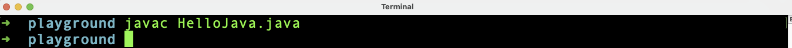

<h1 align="center">Module 1 - Preparation</h1>

## What will you learn in this module

In this module i'll show you what you need to program with Java. I conclude this module with the small program "Hello Java!" with which you get a first insight into programming with Java and serves as a basis for the other modules.

### Requirements

- PC, Laptop or Mac
- Windows,Linux or OSX  operating system installed
- [Java Development Kit](#1)
- [Text editor or IDE](#2)
- Coffee

### Java Development Kit<a name="1"></a>

To program with Java, you need a Java Development Kit (JDK for short), which must be installed on your development computer. It's free to you which version of JDK you want to use, for this course i use AdoptOpenJDK11.

You can download a JDK from the following websites (Be sure you download the JDK not the JRE).
- [Oracle](https://www.oracle.com/java/technologies/downloads/)
- [Oracle OpenJDK](https://jdk.java.net/)
- [AdoptOpenJDK](https://adoptopenjdk.net/)[^1][^2]
- [OpenJDK](https://openjdk.java.net/)

I recommend to download the installer package (msi, rpm, deb, dmg) for your operating system but if you want you can download the zip/tar.gz archive as well.

#### Installation of the JDK

Once you've downloaded the installer, the installation is pretty straightforward.

Navigate to the folder where you downloaded the file and double-click the installer. Follow the instructions and you are almost good to go.

When you have downloaded the archive, you will need to extract the archive to a location where you have read / write access.

#### Environment Variables

Last but not least, check that Java is also available in the console.

The easiest way to open a console window is to use the application launcher from the application list of your OS.

Alternate way :

- Windows
  - Press the Windows-Key on your keyboard
  - Type: **cmd** and hit enter
  
- OSX
  - Press cmd+space on your keyboard
  - Type: **terminal** and hit enter

- Linux (Ubunut/Mint)
  - Press Ctrl+Alt+T 

- Linux (Debian)
  - Press Alt+F2
  - Type: **terminal** and hit enter

In the console window type **echo $JAVA_HOME** and hit enter.


If no path is displayed, you must set the JAVA_HOME variable.

- Windows
  - Right click My Computer and select Properties.
  - On the Advanced tab, select Environment Variables
  - Click on **New...** Button under the **User variables** window
  - In the new window type **JAVA_HOME** in the name field. In the **values** field you have to write the path to the installation of the JDK (ex.: C:\Program Files\Java\adoptopenjdk-11\bin). Click **OK** to leave this window.
  - You have to click **OK** twice to leave the settings window.

- Linux/OSX
  - Depending on your shell (zsh/bash and so on) you have to search for a hidden file in your home directory. Name of the file could be **.profile**, **.zshrc** or something like that. 
  - Open that file with vi/vim/nano (could be empty) and pass in the following lines:


  - Save and close the file
  - Restart the shell or type **source .theFileName** and hit enter

  To check that you have done right open the cmd/shell and type **$echo JAVA_HOME** and hit enter. You should see the path to to installed JDK.

  To check the version of Java type **java --version** and hit enter. You should see the installed version of the JDK.

  


### Text editor or IDE<a name="2"></a>

First things first: You don't need an IDE to program with Java. For modules 2 to 5 I only use a text editor (in my case 'nano'). Nevertheless I also want to talk about the installation of an IDE here because I will use an IDE in later modules. 

#### What is an IDE

An integrated development environment (IDE) is a software application that provides comprehensive facilities to computer programmers for software development. An IDE normally consists of at least a source code editor, build automation tools and a debugger. [^3]

There are many vendors on the market that offer free IDEs and also paid IDEs. The most popular IDEs are Eclipse, NetBeans, IntelliJ and Visual Studio Code.

- [IntelliJ](https://www.jetbrains.com/de-de/idea/)
- [Visual Studio Code](https://code.visualstudio.com/)
- [NetBeans](https://netbeans.apache.org/)
- [Eclipse](https://www.eclipse.org/)

All 4 are free IDEs (IntelliJ is also available in a paid version) and have a wide range of features or can be extended with free plugins. It's up to you which IDE you want to use. I prefer IntelliJ or Visual Studio Code. In later modules I will show you the installation and most important settings of both IDEs. 

As already mentioned, I will only use a text editor for modules 2 to 5.
For Linux and Mac I recommend vi, vim or nano, if you want to work in a shell. For newbies I recommend nano, because it is easier to use. If you need an text editor with a graphical user interface I recommend notepadqq [^4].
Windows users should use notepad (part of Windows) or notepad++ [^5].

```diff
Important!
Don't use Microsoft Word, Pages, OpenOffice or any text editor like that!
```

### Hello Java!

"Hello Java!" or "Hello world!" is a typically first example if you start programming. I will guide you through the steps to create this simple program and explain some things about the code. Therefor i use only a text editor in a console and compile the code in the console as well. You will find the documented source code in the file HelloJava.java. Let's start programming.

First create a directory. 

- Windows users
  - Open a console window by pressing the **Windows key** on your keyboard and typing **cmd** followed by the Enter key, or hold down the **Windows key** and press the **E key** to open Windows Explorer

  - If you are using the console:
    - Navigate to a folder of your choice by typing **cd** followed by a space and the path to that folder (for example: cd c:\myworkspace).
    - Create a new directory in that folder by typing **mkdir java-from-scratch** (or whatever you want to name the directory) and pressing Enter. 
    - Type **dir** and press Enter to verify that the folder was created successfully
  
  - If you are using Windows Explorer:
    - Navigate to the folder of your choice and open it
    - Perform a **right-click** with the mouse in the folder's content view
    - In the context menu that appears, click **New** and then **Folder**.
    - In the following window, type the name for your new folder and press Enter

- Linux/Mac users
  
  - Open a console window
  - Check that you are in your home folder 
    - Type: pwd
    - If you see something like **/user/_yourusername_**, you're already in your home folder
    - If you are not in your home directory, type: <strong>cd ~</strong> and press enter.
    - Check again by typing **pwd**.
  - Create a new directory in your home directory by typing **mkdir java-from-scratch** (or whatever you want to name the directory) and pressing Enter 
  - Type **ls** and press Enter to verify that the folder was created successfully

Now, if you have created a new folder it's time to create a file called "HelloJava.java" in that newly created folder.
The name of the file is important. I'll explain why in a minute.

- Linux/Mac
  - In the console window navigate in the recent created directory.
  - Type: **touch HelloJava.java** and hit enter
  - Type: **ls** and hit enter to check that the file was created

- Windows
  - In the console window navigate in the recent created folder
    - Type: **type nul > HelloJava.java** and hit enter
    - Type: **dir** and hit enter to check that the file was created
  - If you are the Windows Explorer you don't need to create a file first. You create a new File with the Editor and save that file into the recent created folder
    - Open Notepad or Notepad++ and create a new blank file and save this file with name **HelloJava.java**

Now, the file is created we begin with the basic stuff.

Java is an object-oriented class-based programming language.
What does this mean? That means everything in Java are classes, even, in the later course of the tutorial, interfaces and enums are added, these are classes in the true sense. The Java compiler translates every .java file into a class file. 
But what is a class now? With a class you describe objects and their properties of the real world (e.g. class car with properties like color, performance etc.). Even a class that "only" provides methods to perform some calculations describes an object of the real world (a service), although not necessarily a tangible object. 
In later modules, in which I deal with object orientation, I will come back to this topic.

So how do you create a class in Java? This is quite simple and requires only 2 steps. We have already done one of these steps, creating a file (in our case **HelloJava.java**). For the next step we open the file with the text editor and enter the following:

```java
public class HelloJava {

}
```

Save and exit the file.

What does it mean?
The words **public** and **class** are reserved words for Java. That means it is not allowed to use these words for other purposes like ex. naming of variables.

**public** is an access modifier. This means that you can access this class in the whole project. In the modules about object-oriented programming I will go into more detail about access modifiers.

**class** tells the Java compiler that the content is a class. This is important because the structure of classes, interfaces and enums is different.

**HelloJava** is the name of the class. The class can be addressed in the source code via this name.

```diff
The class name and the file name have to be the same. If not you will get a compile error resp. an error in your IDE.
```

Java uses curly braces **{}** to "group". Also at the class level. Each class starts with an opening curly bracket and ends with a closing curly bracket. All methods, properties and so on are specified between these braces.

Now, on the console type: **javac HelloJava.java** and hit enter.
If you have no spellings and Java is correctly installed your console window should look like the following window:


As you can see, you don't see anything at first. Did nothing happen or did I make a mistake? Nope! Type **ls** and press enter. The output should now look like this:


So what happened?

The command **javac** instructed the compiler to translate the file HelloJava.java into Java bytecode and to save the translated code as a **.class** file. If the compiler had detected syntactical errors, the compilation would have terminated with an error output and the .class file would not have been created.

If you want you can view the contents of the .class file in the text editor. It should look something like this: 


But what does this code do? Time to try. Type **java HelloJava** and press enter.

Oops, an error message is displayed. That this error occures is correct. The reason why should explained by the error message itself. With the command **java** we tell the JVM (Java Virtual Machine) that we want to execute the file but a Java program that is to be executable must have a **main** method. In contrast, a library does not need such a main method (but then the Java Program is not executable and has to be put in an executable program).

The code just demonstrates how easy it is to create a Java class and how little you need to do it.

Boring, isn't it? So it's time to fill the class with life.

Open the file again and type bettween the curly braces:

```java
public static void main(String[] args) {
  
}
````

Your class should look like :


Save and exit the file.

Explanation time!

Before I explain what we did, I need to explain what a method is and what characteristics a method has.

What is a method?

A method (should) group a piece of code which has a certain task for the program, e.g. calculation of taxes or calculation of the range of a car.
The structure of a method is always the same:

```diff
access modifier, return type, name, passing parameter, a pair of curly braces
```

Access modifier, return type, name and passing parameter together are called **method head**.

All in the braces are called **method body**.

The name of a method, together with the passing parameters form the so-called **signature** of a method.

```diff
Important!
The signature of a method must always be unique within a class!
```

It is quite possible to have methods with the same name within a class, but then at least the order of the passing parameters must differ. If the parameters have all the same type there is however a problem. The compiler is not interested in the names of the parameters but only looks at their type. If now a method has 2 passing parameters of the same type it doesn't matter for the compiler which parameter comes first because the compiler sees only 2 times the same type.

```java
public void doSomething(TypA parameterA, TypA parameterB) {
  code comes here
}

public void doSomething(TypA parameterB, TypA parameterA) {
  code comes here
}
```

The example above results in a compilation error because the compiler cannot differ the methods, because the compiler sees only:

```diff
doSomething(TypA, TypA){

}
doSomething(TypA, TypA){

}
```

 The following example would work:

```java
public void doSomething(TypA parameterA, TypB parameterB) {
  code comes here
}

public void doSomething(TypB parameterB, TypA parameterA) {
  code comes here
}
```

Same name, same amount of parameters but order and type of parameters are differ.

But now let's get back.
We have implemented the so-called **main method**. The main method has always to look like how we have implemented yet:

```java
public static void main(String[] args){}
```

**main(String[] args)** is the method signature

But what about the rest?

**public**: I hope you rember

**static**: Tells the compiler that this method is a class method, not a object method (more about objects in later modules)

**void**: The method has nothing to return

**main**: The method name (must be **main**!)

**String[] args**: The passing parameter

Let's try out what we have implemented.
Type into the console **javac HelloJava.java** and press enter. If no error occurs (should not) type **java HelloJava** and press enter again.

Nothing happens. Again. But wait, the error is gone. So we seem to have done everything right. But why can't we still see anything? Quite simply, we have not yet told our Java program what to do. Then let's catch up now.

Open the file **HelloJava.java** again and write between the braces of the **main method**:

```java
System.out.println("Hello Java!");
````

Your code should look like:


And again, save and exit the file, type **javac HelloJava.java** and press enter. Type **java HelloJava**, press enter again and here you go.
You should see, finally, something like that:


Congratulations. You have successfully written your first Java program.

To conclude this module, a brief explanation of the inserted line of code.
**System.out.println("Hello Java!");** is a statement (in this case a call to the method **println**) and means nothing else than that the sentence "Hello Java!" should be printed on the command line. For this you should know that in the JDK there are already many predefined classes and methods that we can use. **System** is such a class. The class **System** provides some useful tools, like **out**, a so called instance variable (what this is I will explain in later modules), which brings us the method **println**. With **println** we tell Java that we want the text inside the round brackets (inside the double quotes) to be printed to the console, followed by a newline.

So, that should be it for module 1. 

Bring me to [module 2](../module2). 

[^1]: recommended.
[^2]: AdoptOpenJDK is moving to the Eclipse Foundation and rebranding [https://adoptium.net/].
[^3]: [Source Wikipedia](https://en.wikipedia.org/wiki/Integrated_development_environment)
[^4]: [notepadqq](https://itsfoss.com/notepadqq-notepad-for-linux/)
[^5]: [Notepad++](https://notepad-plus-plus.org/downloads/)
